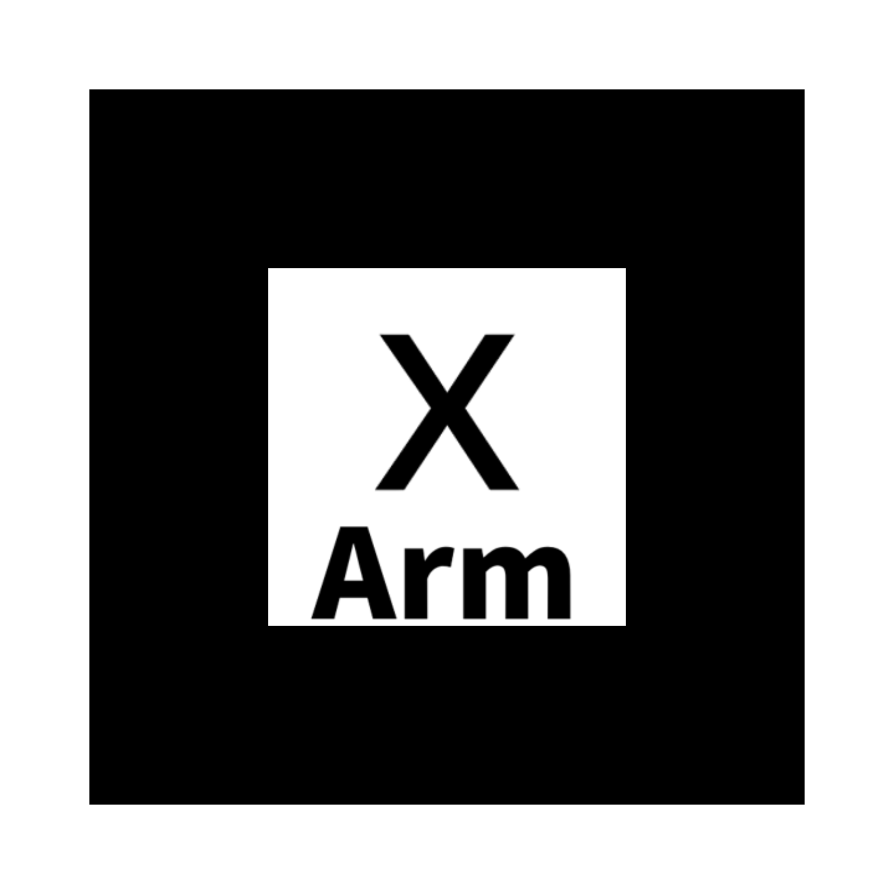
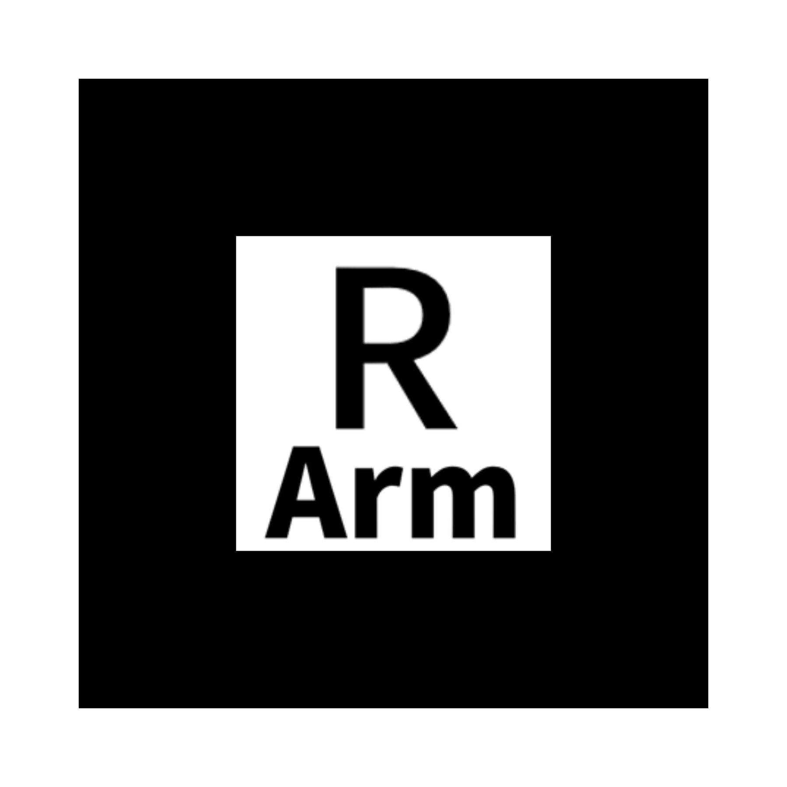

# AR_Education
Educational use AR platform developed with **AR.js** framework

 *Custom Version*
 *Backup Version*

 

**Marker**
Arm

 
 

 
 

Console

 
 

 
 

Vision

 
 

 
 

Surgical System
Currently using model purchased from https://www.artstation.com/marketplace/p/Jxmq/surgical-system-da-vinci-xi-model-3d-model

The model can be DIY using **3Ds Max** then export as FBX, then futher converted to gltf on https://convert3d.org/fbx-to-gltf.
*(Direct exported from 3Ds Max not satisfactory)*

**Digital Ocean**
Linked with Github repository(Auto update when committed)
Http domain or Redirect route can be set through Digital Ocean.

For Local testing (safer than testing on published version)
-Android: 
 download *Android Debug Bridge* and follow the guide on https://developer.android.com/tools/adb?hl=zh-tw to luanch live server on the testing mobile device.

*Control panel* 
-Log in Digital Ocean Platform, go to Project<Jiachen Zhang>, Droplets<Lab-website>
-Click <Access> in the left toolbar to launch the droplet console
-Recommand log in with account *AR* {pw: biolabAR} instead of *root*. _Reference:https://github.com/PerfectlySoft/PerfectDocs/blob/master/guide.zh_CN/deployment-DigitalOcean.md_